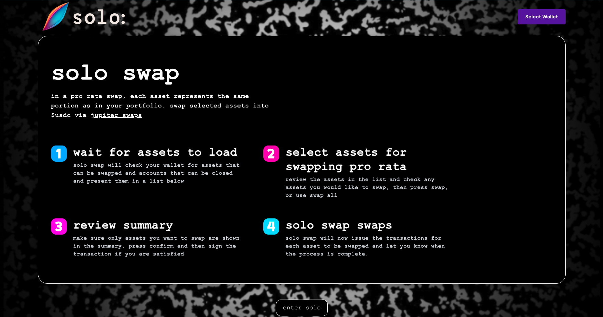

# coming soon

solo: is building, keep an eye out here for updates on exciting developments!

## solo swap

solo swap is a pro-rata swapper that allows users to specify a percentage of their portfolio to swap to global stables. 

solo swap will be callable within a realms instruction, allowing dao members to specify a percentage of the treasury to be liquidated. when the multi-signature is approved, the quote prices for the specified percentage are re-fetched at the latest market prices, eliminating the need to transfer funds out in order to get liquidity. 

*lovingly poached from bonklabs [pooperscooper](https://github.com/BonkLabs/pooperscooper)*