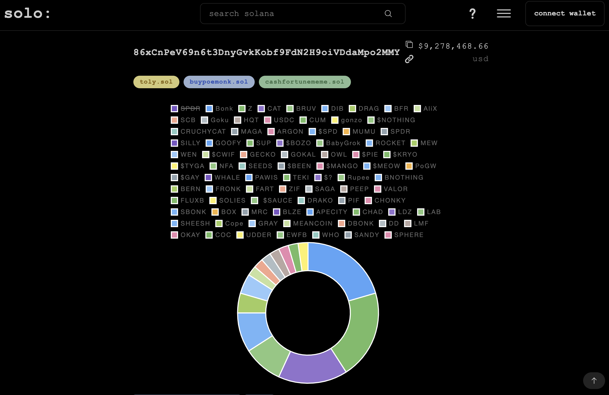

# view tokens

select the tokens tab to view holdings



## filter pie

remove tokens from the pie chart by clicking their ticker


## download portfolio


example:

```
Token List and portfolio allocation, sans Solana:

xxxxx
Total Value: $000.00
Portfolio Allocation: 00.00%


xxxxx
Total Value: $000.00
Portfolio Allocation: 00.00%


xxxxx
Total Value: $000.00
Portfolio Allocation: 00.00%
```
